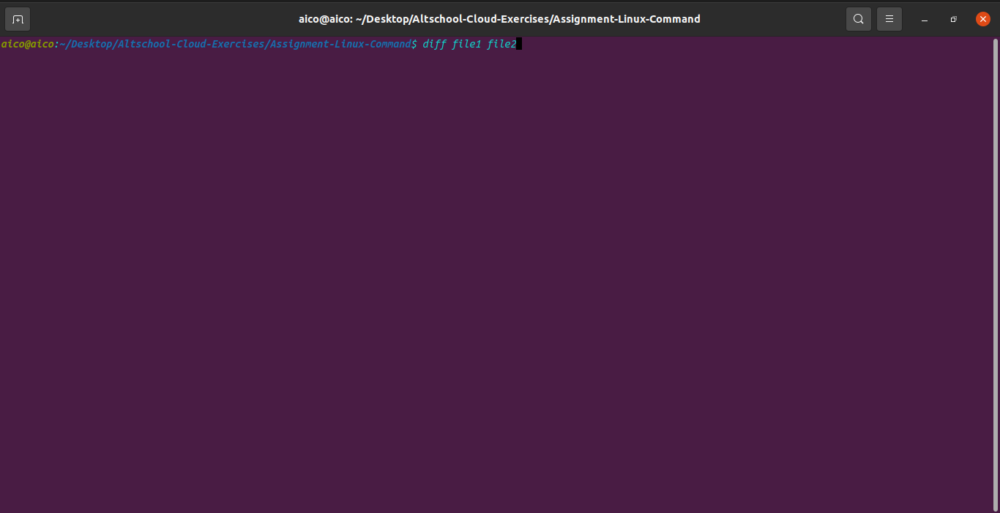

diff - 
This command compares the contents of two files and displays the differences. Suppose you have a file called file1 and you edit some part of it and save it as file2. To see the differences type

% diff file1 file2

Lines beginning with a < denotes file1, while lines beginning with a > denotes file2.

