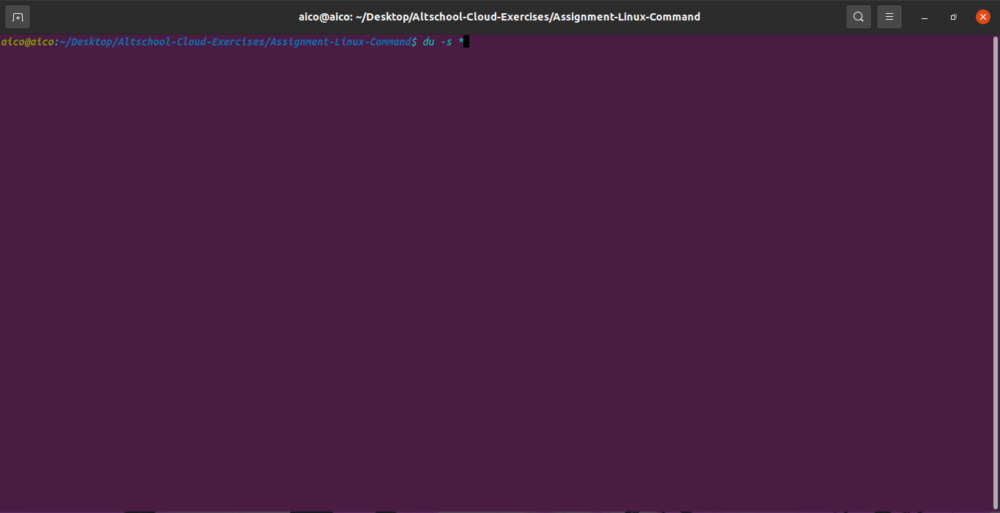

du
The du command outputs the number of kilobyes used by each subdirectory. Useful if you have gone over quota and you want to find out which directory has the most files. In your home-directory, type

% du -s *

The -s flag will display only a summary (total size) and the * means all files and directories.

