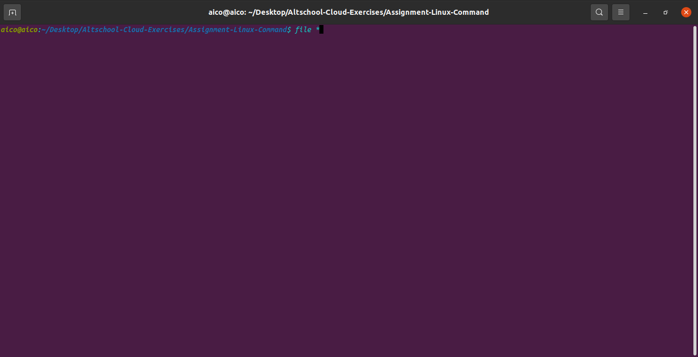

file -
file classifies the named files according to the type of data they contain, for example ascii (text), pictures, compressed data, etc.. To report on all files in your home directory, type

% file *

