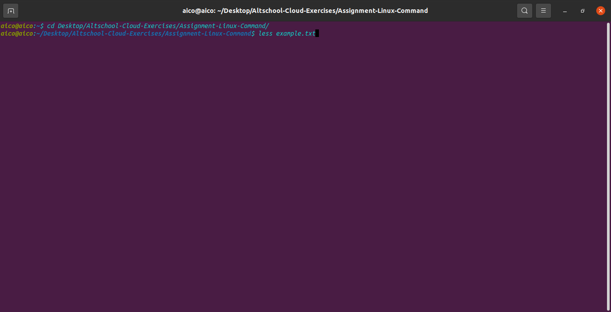

less - This command writes the content of a file onto the screen a page at a time.
              % less "name of file".
For example we have a file "example.txt" to display the content at a time-
              % less example.txt

