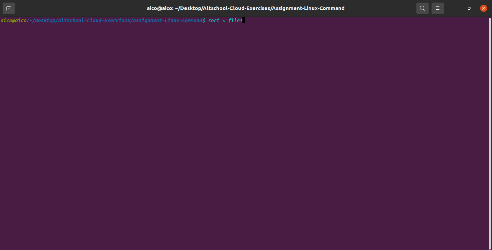

"<" - We use the "<" Symbol to redirect the input of a command. For example to arrange a list of items in file1 alphabetically or numerically we can use the sort command. Using < you can redirect the input to come from file1. 
                                                   % sort < file1

