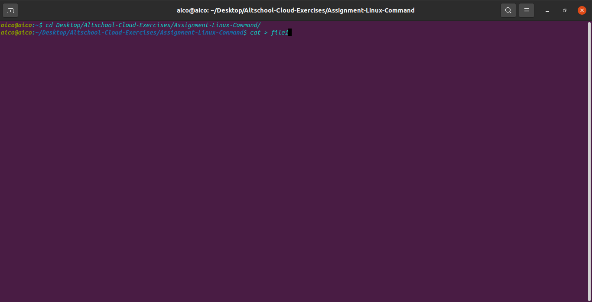

cat > - We use the ">" Symbol to redirect the output of a command. For example to create a file called file1 containing a list of names. 
                                                   % cat > file1

