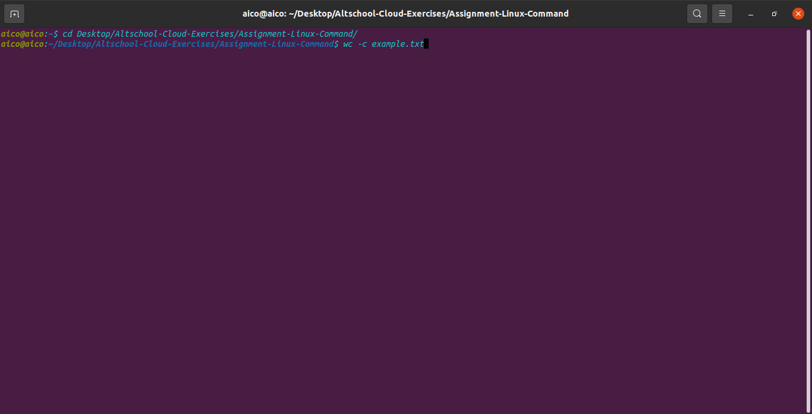

wc (word count) - The command is used to count the number of lines, words and characters.
              % wc "option" "name of file"
For example we have a file "example.txt" to display the number of lines in the file -
              % wc -l example.txt

For example we have a file "example.txt" to display the number of words in the file -
              % wc -w example.txt

For example we have a file "example.txt" to display the number of characters in the file -
              % wc -c example.txt

